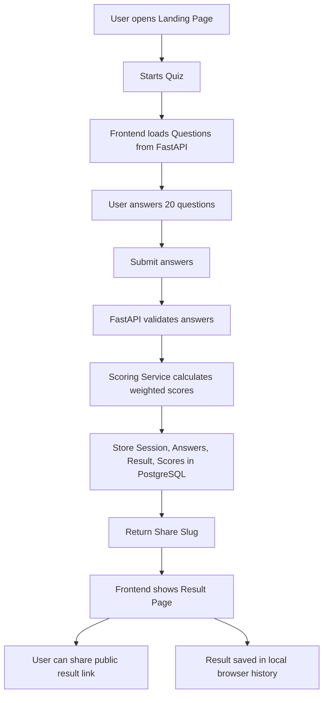
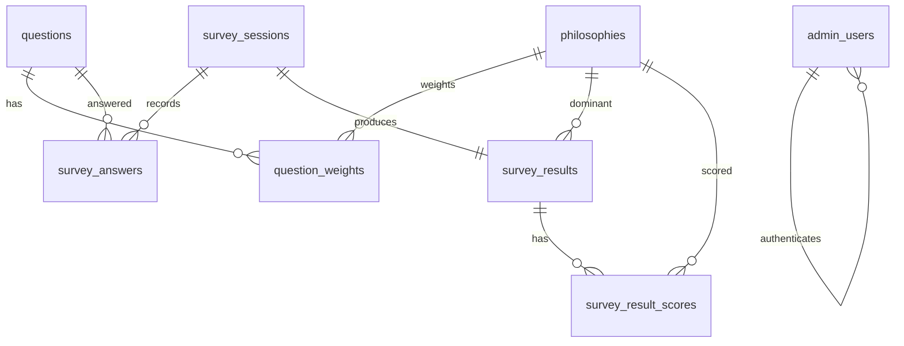
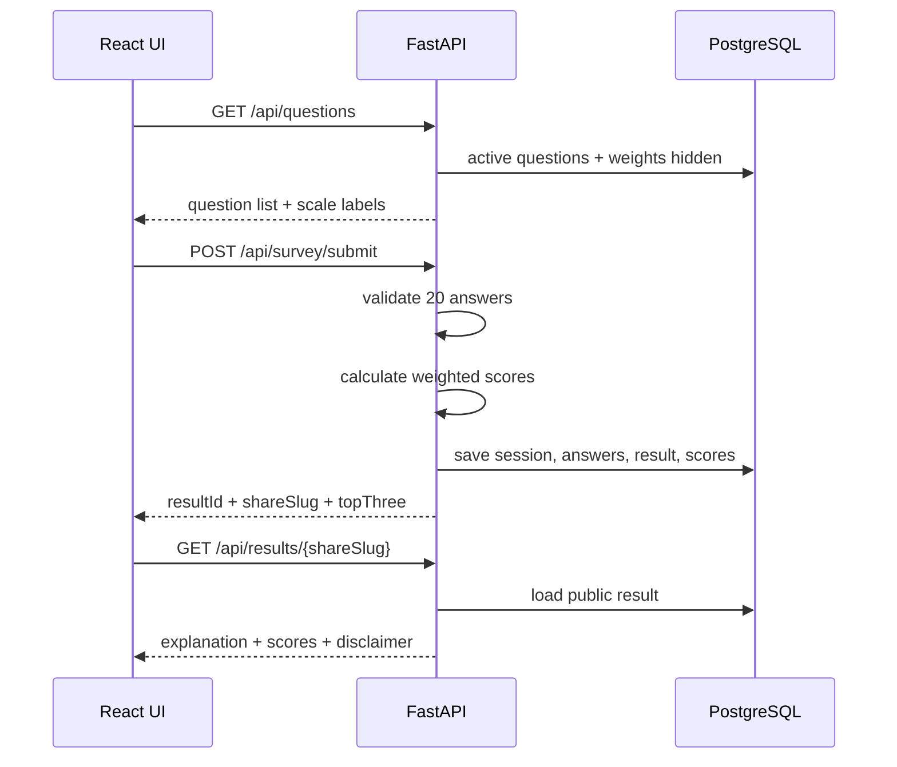
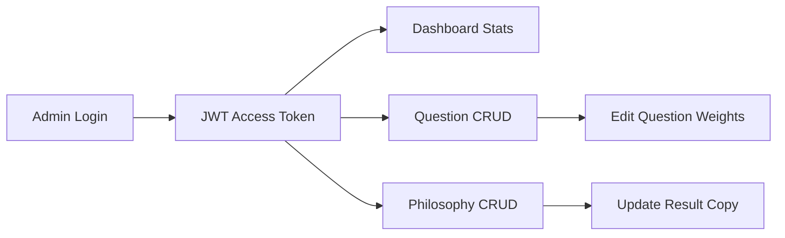

# Architecture

## System Overview

TriếtLýLàGì? is a deterministic quiz app. The frontend collects 20 Likert-scale answers, FastAPI validates the complete submission, the scoring service calculates weighted normalized scores, and PostgreSQL stores the public result behind a share slug.



## Database Design



Main tables:

- `philosophies`: profile copy, strengths, blind spots, style explanations, illustration key.
- `questions`: scenario question text, section, order, active flag.
- `question_weights`: deterministic scoring weights by question and philosophy.
- `survey_sessions`: anonymous client id, public share slug, user agent, completion timestamps.
- `survey_answers`: validated Likert answers.
- `survey_results`: summary and dominant/secondary philosophy.
- `survey_result_scores`: raw score, normalized percentage, rank for every philosophy.
- `admin_users`: email and hashed password for JWT login.

## API Flow



## Scoring Flow

For each answer:

```text
score[philosophy] += answer_value * weight
```

Normalization is per philosophy:

```text
percentage = raw_score / max_possible_score_for_that_philosophy * 100
```

This keeps profiles with fewer weighted questions from being unfairly penalized. Ties are deterministic: higher percentage, then higher raw score, then philosophy key.

## Admin Flow



Admin endpoints require a bearer token. Quiz takers never log in and are only tracked by a browser-generated anonymous client id.

## Boundaries

- API routes stay thin and call services.
- Services contain business rules and validation.
- Repositories contain SQLAlchemy data access.
- `scoring_service.py` is pure and unit-testable.
- Seed content lives in `app/seed`, separate from runtime logic.
